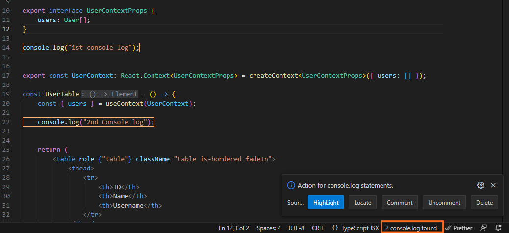

This Visual Studio Code extension provides functionality to count, locate, comment, and delete `console.log` statements in your code.

## Features

- Counts the number of `console.log` statements in the active text document and displays the count in the status bar.
- Provides options in the status bar to perform actions on `console.log` statements:
  - **Highlight**: Highlights all lines containing `console.log` statements.
  - **Locate**: Move the cursor to the first `console.log` occurrence.
  - **Comment**: Comments out all `console.log` statements.
  - **Uncomment**: Uncomments all commented `console.log` statements.
  - **Delete**: Deletes all `console.log` statements.

## Usage

1. Open a text document containing your code.
2. The extension will automatically count the `console.log` statements and display the count in the status bar.
3. Click on the status bar item to open a dropdown menu with action options for `console.log` statements.
4. Choose an action from the dropdown menu to perform the selected action on `console.log` statements.

## Notes

- The extension works for JavaScript and Typescript files.
- The count and actions are based on exact occurrences of `console.log` in the code. It does not consider variations like `console.Log` or `Console.log`.
